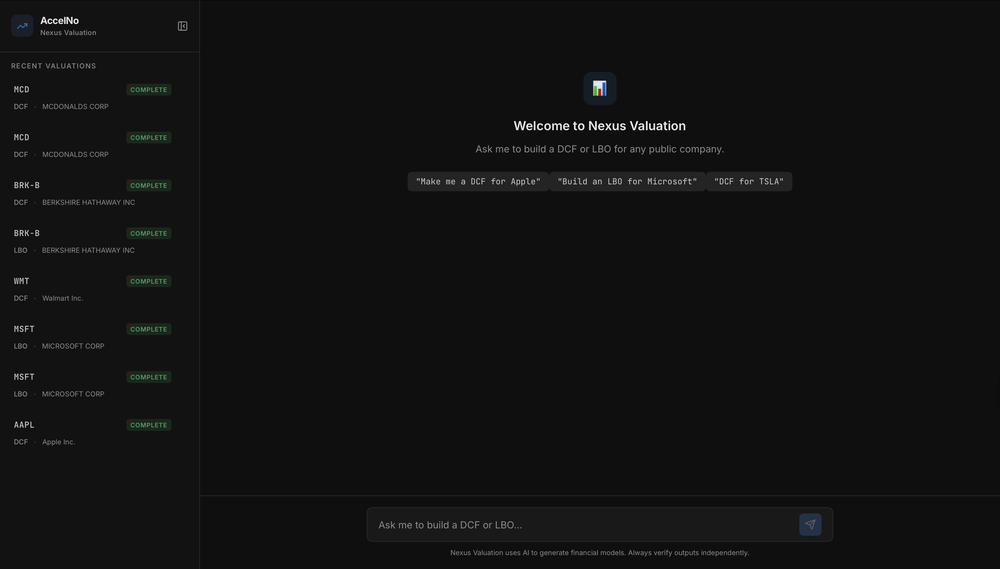
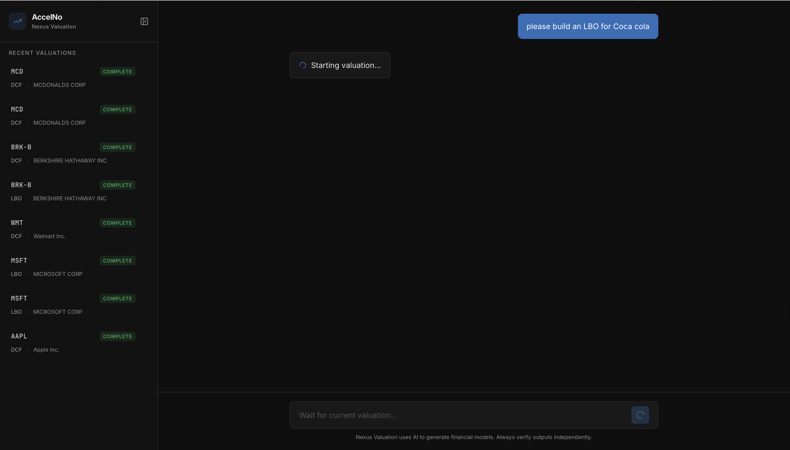
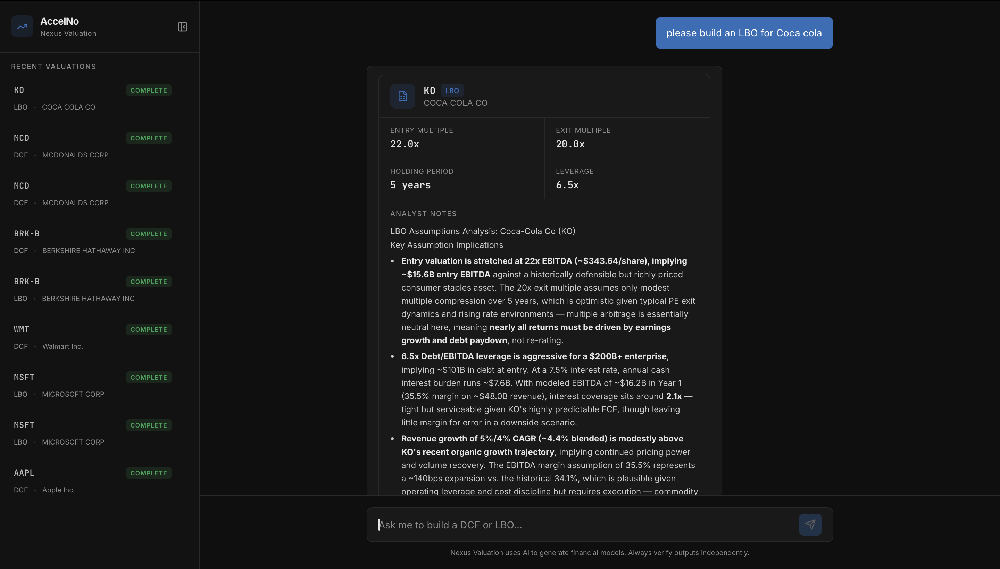
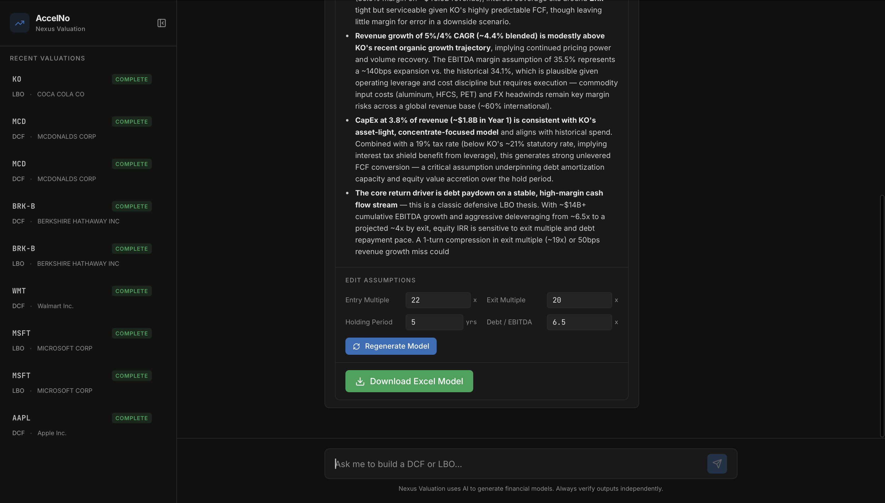
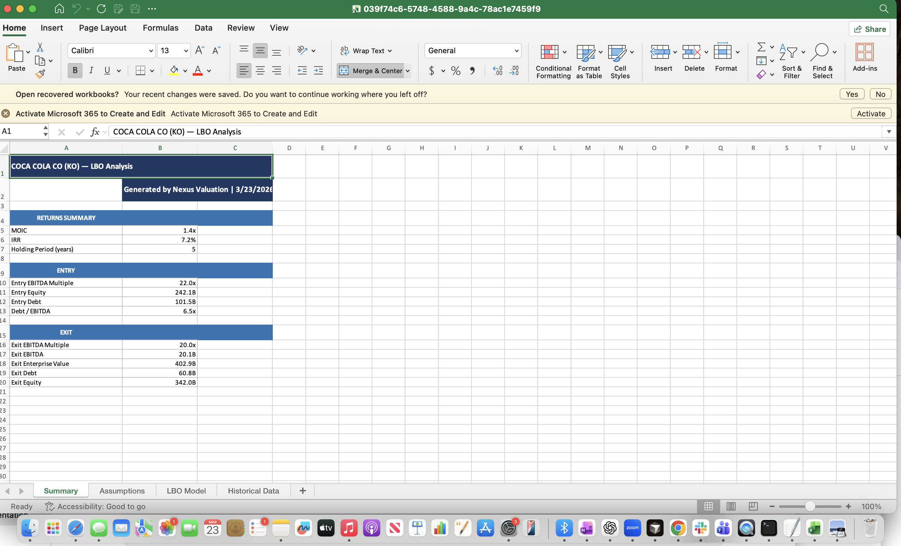

# Nexus Valuation

AI-powered valuation tool for public companies. Type any company name, and the system fetches real SEC EDGAR filings, generates a Claude-powered financial model, and produces a downloadable, formatted Excel workbook — all through a chat interface.

+**Live app: [nexusaccelno.malva.company](https://nexusaccelno.m 
        +alva.company)**  
---

## Screenshots

### Welcome screen — recent valuations in sidebar


### Starting a valuation — "please build an LBO for Coca Cola"


### Completed LBO — analyst notes, key assumptions


### Edit assumptions + Download Excel


### Downloaded Excel — Summary tab (Coca Cola LBO)


---

## How it works

1. **User types** — *"Build me a DCF for Chipotle"* or *"LBO for Coca Cola"*
2. **Company name resolves** to a ticker via SEC EDGAR (no manual ticker needed)
3. **SEC filings are fetched** — 5 years of income statement, balance sheet, and cash flow data
4. **Claude generates assumptions** — WACC, growth rates, margins, entry/exit multiples — grounded in historical data
5. **Model is calculated** — full unlevered DCF or leveraged buyout math
6. **Excel is generated** — 4-tab workbook: Summary, Assumptions, Model, Historical Data
7. **User can adjust** — edit assumptions inline or type follow-ups like *"lower the entry multiple to 10x"*

---

## Repository structure

```
nexus-valuation/
├── backend/          # Node.js/TypeScript API — deployed on Railway
│   ├── src/
│   │   ├── routes/   # Express route handlers
│   │   ├── services/ # SEC fetcher, Claude engine, valuation math, Excel generator, Supabase client
│   │   └── types/    # Shared TypeScript types
│   ├── supabase/     # schema.sql — run once in Supabase SQL Editor
│   └── package.json
├── screenshots/      # UI screenshots
├── ui/               # Lovable frontend (see ui/README.md)
└── README.md
```

---

## Tech stack

| Layer | Technology |
|-------|-----------|
| Backend API | Node.js + TypeScript + Express |
| AI | Claude Sonnet 4.6 (Anthropic) |
| Financial data | SEC EDGAR public API (free, no key required) |
| Excel generation | ExcelJS |
| Database + Storage | Supabase (Postgres + Storage buckets) |
| Frontend | Lovable |
| Deployment | Railway |

---

## Running the backend locally

### Prerequisites
- Node.js 18+
- A Supabase project (free tier works)
- An Anthropic API key

### 1. Clone and install

```bash
git clone https://github.com/Abangseopa/nexus-valuation.git
cd nexus-valuation/backend
npm install
```

### 2. Set environment variables

```bash
cp .env.example .env
```

Edit `.env`:

```env
ANTHROPIC_API_KEY=your_anthropic_key
SUPABASE_URL=https://your-project.supabase.co
SUPABASE_SERVICE_ROLE_KEY=your_service_role_key
PORT=3000
```

### 3. Set up Supabase

In your Supabase project → **SQL Editor** → paste and run `supabase/schema.sql`.

This creates:
- `valuation_sessions` — tracks every valuation request and its status
- `sec_cache` — caches SEC data per ticker (24h TTL, avoids re-fetching)
- `valuation-files` storage bucket — stores generated Excel files, served via signed URLs

### 4. Start the dev server

```bash
npm run dev
```

API running at `http://localhost:3000`.

---

## API endpoints

| Method | Endpoint | Description |
|--------|----------|-------------|
| `GET` | `/health` | Health check |
| `GET` | `/api/valuation/search?q=chipotle` | Resolve company name → ticker |
| `POST` | `/api/valuation/start` | Start a DCF or LBO — returns `sessionId` immediately |
| `GET` | `/api/valuation/status/:id` | Poll for progress (`pending → fetching_data → generating → complete`) |
| `POST` | `/api/valuation/chat` | Adjust assumptions via natural language, triggers Excel regeneration |
| `GET` | `/api/valuation/download/:id` | Get a fresh signed download URL for the Excel file |
| `GET` | `/api/valuation/sessions` | List recent sessions |

### Example

```bash
# Start a DCF
curl -X POST https://nexus-valuation-production.up.railway.app/api/valuation/start \
  -H "Content-Type: application/json" \
  -d '{"ticker": "KO", "valuationType": "lbo"}'

# Returns immediately:
# { "success": true, "data": { "sessionId": "abc-123", "status": "pending" } }

# Poll until complete
curl https://nexus-valuation-production.up.railway.app/api/valuation/status/abc-123
```

---

## Excel output

Each generated workbook has 4 tabs:

| Tab | Contents |
|-----|----------|
| **Summary** | Key outputs — EV + equity value (DCF) or MOIC + IRR (LBO) |
| **Assumptions** | All model inputs, amber-highlighted (standard IB convention) |
| **DCF / LBO Model** | Full year-by-year model — UFCF waterfall or debt schedule |
| **Historical Data** | Raw SEC data: income statement, margins, cash flows, balance sheet |

---

## Deploying the backend

```bash
cd backend
railway login
railway init        # name it "nexus-valuation"
railway up
railway variables set ANTHROPIC_API_KEY=...
railway variables set SUPABASE_URL=...
railway variables set SUPABASE_SERVICE_ROLE_KEY=...
railway domain      # get your public URL
```

In Railway dashboard → Service Settings → **Root Directory** → set to `/backend`.

---

## Environment variables

| Variable | Description |
|----------|-------------|
| `ANTHROPIC_API_KEY` | Anthropic API key — [console.anthropic.com](https://console.anthropic.com) |
| `SUPABASE_URL` | Your Supabase project URL |
| `SUPABASE_SERVICE_ROLE_KEY` | Service role key (Supabase → Settings → API) |
| `PORT` | Server port (default 3000 — Railway sets this automatically) |
